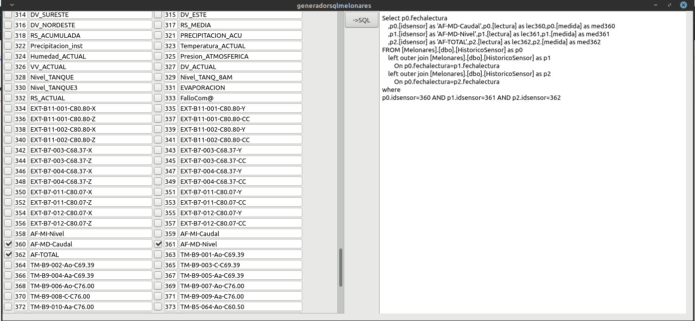

# Utilidad: Generador de expresiones SQL para base de datos Melonares-Sensores

Genera facilmente expresiones SQL "join" para mostrar sensores, lecturas y medidas en columnas seleccionandolos desde la lista.

Autor:
Julio Sanchez Berro

